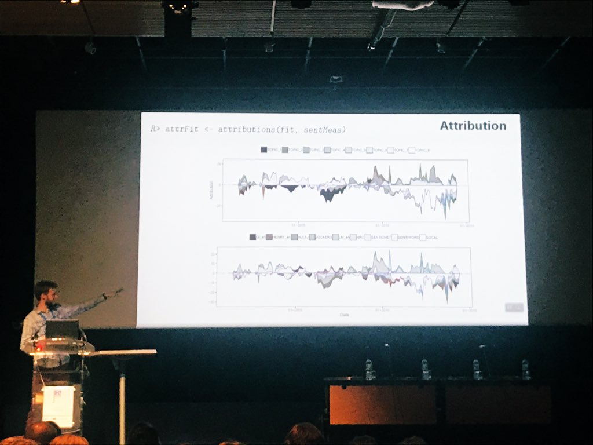

# Public speaking

I love giving talks and workshops! Here is a list of the ones I have done in the past. It's been a while, but I plan to take this up more often in the near future. 🎤

<figure>
  
  <figcaption><em>Presenting at the useR! 2019 conference in Toulouse</em></figcaption>
</figure>

## Talks

- **August 2020** (Brussels) | Public PhD defense
  - "Sentiment and Econometrics: Toward A Unified Framework of Textual Sentiment Analysis for Economic and Financial Applications" [[slides]](slides/PhDdefense_2020.pdf)
- **January 2020** (Leuven) | 23rd Data Science Leuven Meetup
  - "Sentometrics - Aggregate textual data into index solutions" [[slides]](slides/DSMeetupLeuven_2020.pdf)
- **December 2019** (London) | International Conference on Computational and Financial Econometrics
  - "Conservative and timely ESG-compliant investment screening using text mining" [[slides]](slides/CFE_2019.pdf)
- **July 2019** (Toulouse) | useR!
  - "The R package sentometrics to compute, aggregate and predict with textual sentiment" [[slides]](slides/useR!_2019.pdf) [[video]](https://www.youtube.com/watch?v=nAlHzz4CP9E)
- **May 2019** (Ispra) | BigNOMICS Workshop on Big Data and Economic Forecasting
  - "The Sentometrics approach for textual sentiment based prediction" [[slides]](slides/BigNOMICS_2019.pdf)
- **September 2018** (Vienna) | International Conference on Data Science in Finance with R
  - "The R package sentometrics to compute, aggregate and predict with textual sentiment" [[slides]](slides/DSF-R_2018.pdf)
- **June 2018** (Winterthur) | SwissText
  - "Indexation and monitoring of corporate reputation using the R package sentometrics" [[poster]](slides/SwissText_2018.pdf)
- **June 2018** (Chicago) | R/Finance
  - "The R package sentometrics to compute, aggregate and predict with textual sentiment" [[slides]](slides/RFinance_2018.pdf)
- **May 2018** (Budapest) | European R Users Meeting (eRum)
  - "An integrated framework in R for textual sentiment time series aggregation and prediction" [[slides]](slides/eRum_2018.pdf) [[video]](https://www.youtube.com/watch?v=KC8LSBNvZrQ)
- **December 2017** (London) | International Conference on Computational and Financial Econometrics
  - "Accounting for non-normality and luck in fund peer performance evaluation" [[slides]](slides/CFE_2017.pdf)

## Workshops
- **November 2021** (Brussels) | Solvay Brussels School
  - Two-day "Prediction in R" hackaton as part of Solvay's Executive Program in Business Analytics
- **May 2021** (remote) | Belgian Association of Marketing (BAM)
  - Gave the "Essentials of coding/modeling" session as part of BAM's "Discover Data Science" course [[slides]](slides/BAM_2021.pdf)
- **January 2018** (Amsterdam) | Vrije Universiteit Amsterdam
  - Multi-session data case workshop on text mining for marketing students
